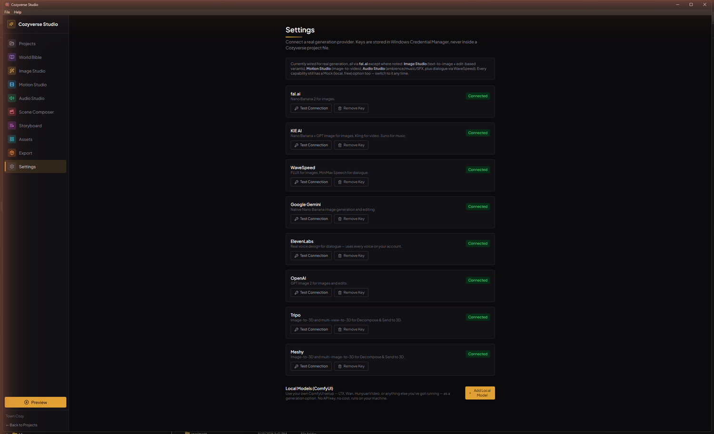
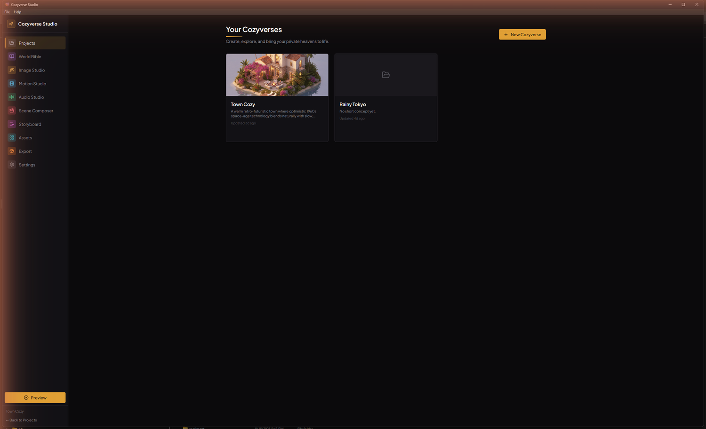
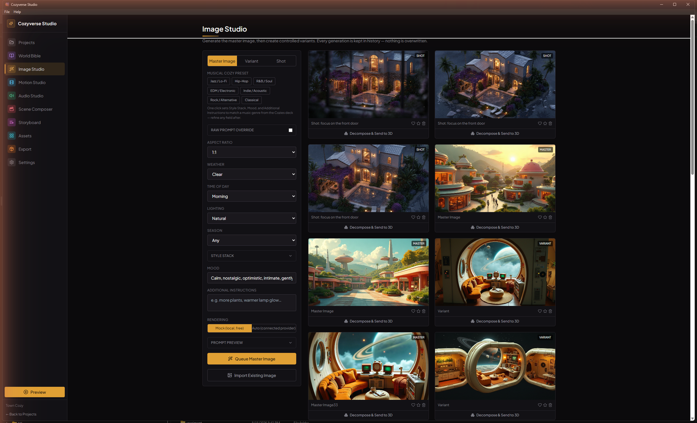
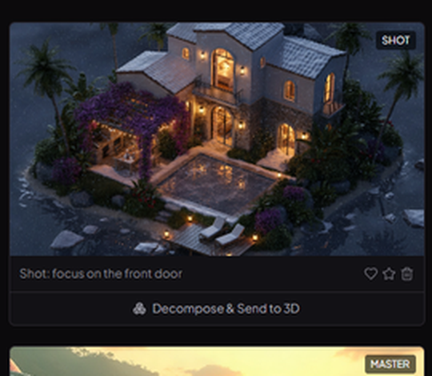
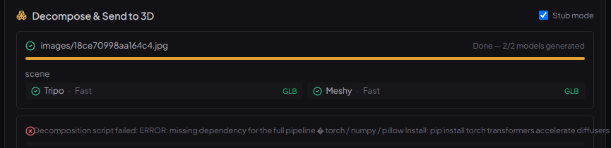
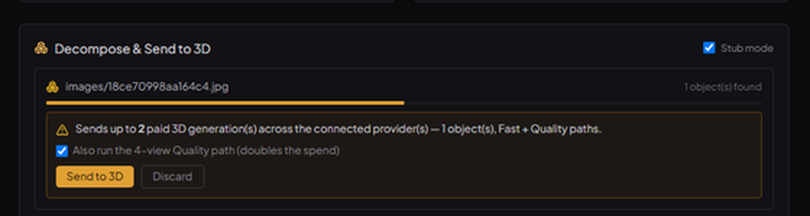
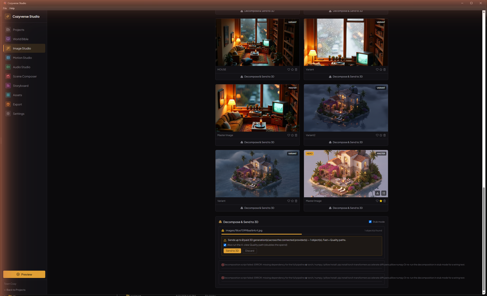
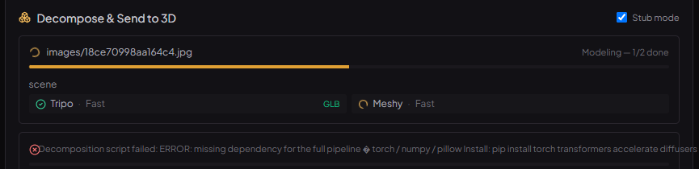
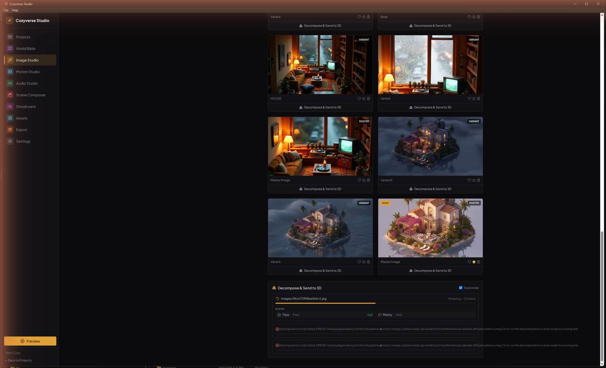

# Tutorial — Decompose an image into 3D models

Turn one Cozyverse image into separate, textured **3D models (`.glb`)** — one per
object in the scene — using **Tripo** and **Meshy**, both driven from inside
Cozyverse Studio. No second app to run.

Every screenshot below is from a real run on the sample project **Town Cozy**.

---

## Before you start

| Requirement | Why | Notes |
|---|---|---|
| A **Tripo** or **Meshy** API key | The 3D models come from their cloud APIs — the only paid part | Add it in **Settings** (Step 1). One key is enough; with both, each object goes to both. |
| **Python** on your PATH | The image is split into objects by a local Python script | Override the command with the `COZY_PYTHON` env var; point at the script with `COZY_DECOMPOSE_SCRIPT` if it isn't beside the app. |
| *(Full pipeline only)* `pip install torch transformers accelerate diffusers pillow numpy` | GPU object detection + novel-view synthesis | **Stub mode** (Step 4) skips all of this — use it for your first run. |

**Segmentation is local and free.** Nothing reaches a provider, and nothing is
billed, until you press **Send to 3D** in Step 6.

---

## Step 1 — Add a Tripo or Meshy key

Open **Settings** from the left nav. Scroll to the provider list — **Tripo** and
**Meshy** are near the bottom. Paste a key, **Save**, then **Test Connection**.



Keys live in the Windows Credential Manager, never in a project file.

---

## Step 2 — Open a project that has an image

From the **Projects** dashboard, open any Cozyverse with at least one image in
it. (No image yet? Generate or import one in Image Studio first.)



---

## Step 3 — Find the button in Image Studio

Go to **Image Studio**. Every image card has a full-width **Decompose & Send to
3D** button along its bottom edge.





---

## Step 4 — First time: turn on Stub mode

Below the gallery sits the **Decompose & Send to 3D** panel. Tick **Stub mode**
in its header.



Stub mode skips the GPU pipeline: it makes **one** placeholder object from the
whole image, no orthographic views. It's for confirming the chain works —
segment → confirm → submit → poll → download — before you invest in a full run.
The 3D providers are still called on **Send**, so you still get real `.glb`
files back (just one object, from the whole image).

Leave it **off** for the real thing: multiple objects, four synthesized views
each.

---

## Step 5 — Click Decompose

Click **Decompose & Send to 3D** on the image you want. The panel shows the job
run through **Segmenting image…**.

- **Full mode:** ~10–30 s on a 12 GB GPU — detects objects, cuts each out on
  white, and (for the Quality path) synthesizes front / left / back / right views.
- **Stub mode:** near-instant.

If the full pipeline's Python packages aren't installed, the job fails here with
a clear message (`missing dependency … torch / numpy / pillow …`) — switch to
Stub mode or install them.

---

## Step 6 — Review the estimate, then confirm

When segmentation finishes, the job card shows **N object(s) found** and an amber
confirmation block.



It spells out **how many paid generations** pressing Send will start:

```
objects  ×  providers with a key  ×  (1 Fast  +  1 Quality, if 4 views exist)
```

- **☑ Also run the 4-view Quality path** — leave ticked for best fidelity; untick
  for Fast-path only (half the spend).
- **Send to 3D** — starts generation. **This is the paid step.**
- **Discard** — throws the decomposition away. Costs nothing.



---

## Step 7 — Watch the models generate

After **Send to 3D**, each object shows a small grid — one cell per
provider × path — moving `pending → running → succeeded`.



- **Fast** (perspective crop → single-image model): ~1–2 min.
- **Quality** (4 views → multi-view model): ~2–5 min, higher fidelity.
- A green **GLB** tag appears once that model has downloaded.



With both providers connected and the Quality path on, that's **up to four
`.glb` files per object** (Tripo Fast, Tripo Quality, Meshy Fast, Meshy
Quality). They run in parallel, rate-limited so the providers don't push back.

---

## Step 8 — Collect the results

When the card reads **Done — X/Y models generated**, the files are in your
project folder:


```
Documents/Cozyverses/<project>/assets/models/
  18cff8_asset_0_meshy_perspective-18cff8eb.glb    (80 MB)
  18cff8_asset_0_tripo_perspective-18cff8e6.glb    (42 MB)
```

Each file is `<object>_<provider>_<path>-<id>.glb`. Open them in any 3D viewer,
or in **ModelForge** for rigging / retopology / format conversion.

*(The run above is a real stub-mode run: one object → one Tripo model + one
Meshy model, both downloaded.)*

---

## Troubleshooting

| Symptom | Cause / fix |
|---|---|
| Error: "Connect a Tripo or Meshy API key…" | A one-shot decompose with no key. Add a key (Step 1). Decomposition with the confirm step still runs without one — it only asks at **Send to 3D**. |
| "decompose_pipeline.py was not found" | Set `COZY_DECOMPOSE_SCRIPT` to the script's full path, or place it beside the app executable. |
| "Could not start Python" | Python isn't on PATH or has another name — set `COZY_PYTHON` (`python3`, or a full path). |
| Segmentation fails: `missing dependency … torch / numpy / pillow` | Full-pipeline packages aren't installed. Use **Stub mode**, or `pip install torch transformers accelerate diffusers pillow numpy`. |
| A provider job turns red | Hover it for the reason (out of credits, rejected image, rate-limit). The other jobs continue. |
| Re-clicking Decompose does nothing new | Identical input is de-duplicated so you're not charged twice — it surfaces the existing job. Change a setting to force a fresh run. |

## Advanced options

`DecomposeOptions` (from the UI, or directly via the `decompose_image` /
`submit_decomposition` commands) also accepts: `tripoModelVersion`, `meshyModel`
(default `meshy-7`), `textureResolution` (Meshy up to 8192), `quadTopology`,
`targetPolycount`, `pbr`, `providers` (subset of `["tripo","meshy"]`), and raw
`meshyExtra` / `tripoExtra` param maps merged verbatim into every request.
